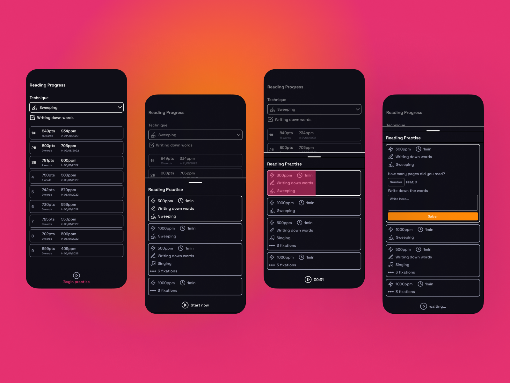
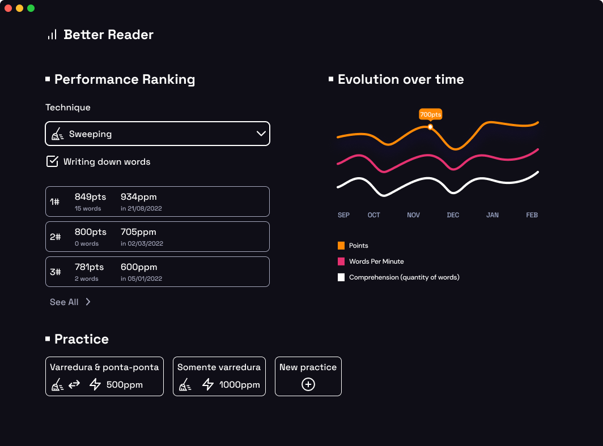

## Better Reader

Mobile first Desktop Electron application. For those who wan't to track their evolution on speed reading.

### Mobile:

<a href="https://dribbble.com/shots/18123589-A-speed-reading-practice-app">
  
</a>

### Desktop:

<a href="https://dribbble.com/shots/18743010-Better-Reader-desktop-design">
  
</a>

### Business rules

Each practice is worth points. The calculus to determine it is the following:

```
wpm = words per minute
words = quantity of words noted in pos-read
comprehension = percentage of confidence you have on what you just read

wordsWeight = to note words has a weight of 0.5
comprehensionWeight = the comprehension is the more important, so has a weight of 1

points = wpm + words * 0.5 * comprehension * 1

```
